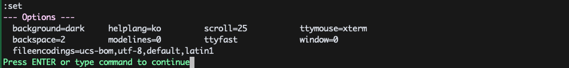
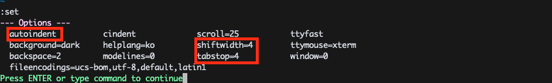
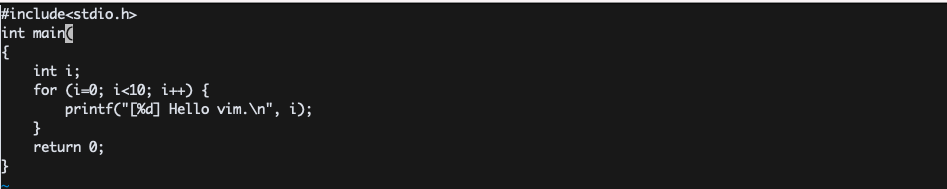
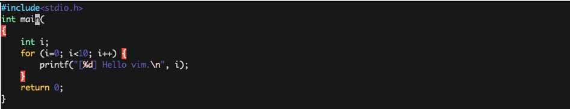
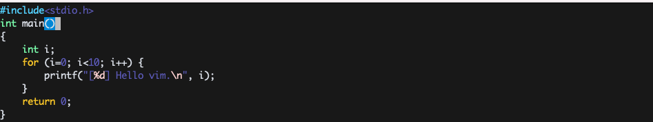
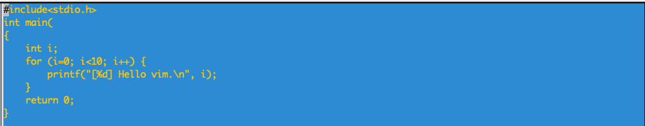

# VIM PRACTICE 10일차

> 책 "손에 잡히는 VIM"의 3장 내용을 공부한 내용입니다. 이 문서는 3.2절만 정리합니다.

## 옵션과 색상 테마 저장하기(vim 설정 파일)

`VIM`은 `~/.vimrc`라는 파일을 읽어서 설정을 리로드한다. 가령 `~/.vimrc`에 다음을 저장했다고 가정해보자.

~/.vimrc
```
set ai cindent
set ts=4 sw=4
```

그럼 `:set`을 했을 때 자동으로 설정된 것을 알 수 있다.

설정 이전


설정 이후


또한 `C`언어 같은 경우 문법 하이라이팅 기원도 제공한다. 어느 정도 문법 오류도 잡아낼 수 있다. [ex01.c]()를 열고 `:syntax enable`을 명령해보자.

설정 이전


설정 이후


문법을 고치면 다음과 같이 변경된다.

고친 이후


또한 `:colorscheme <scheme>`를 통해 배경 테마를 변경할 수 있다.


설정 이전


설정 이후(colorscheme blue)

