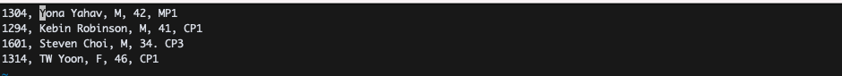
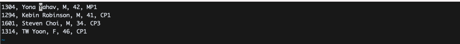
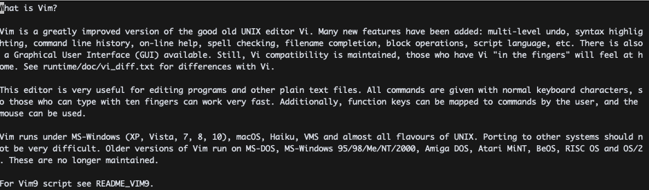
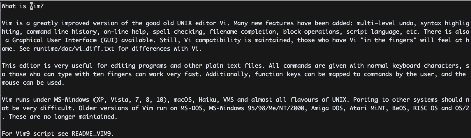
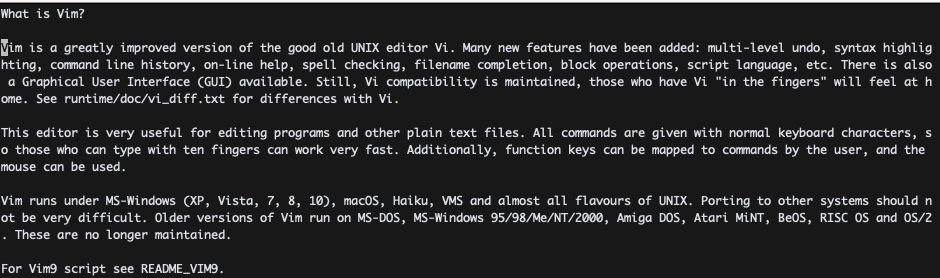
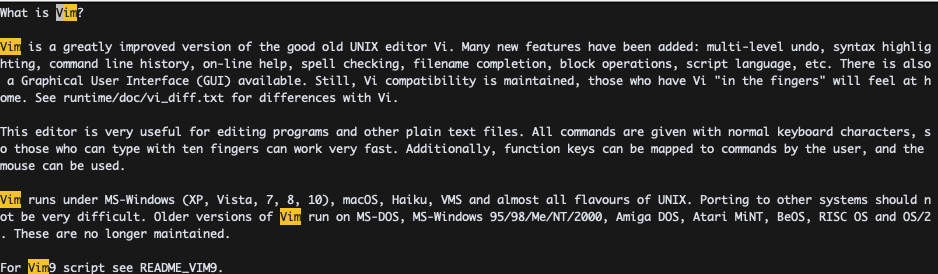
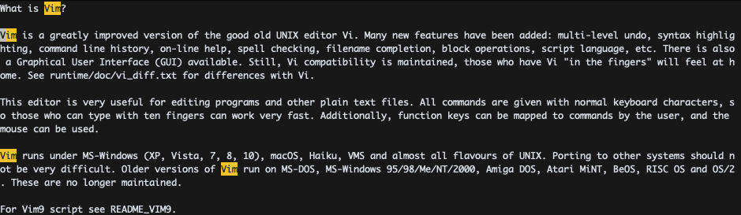

# VIM PRACTICE 11일차

> 책 "손에 잡히는 VIM"의 4장 내용을 공부한 내용입니다. 이 문서는 4.2절만 정리합니다.

## 문자, 문자열 검색하기

문자 검색은 `f + <문자>`다. 가령, 다음 [예제](https://github.com/gurumee92/vim-practice/blob/main/src/day11/ex01.txt)글이 있다고 가정해보자.

현재 입력 모드에서  `f + Y`를 눌러본다.

그럼 현재 줄의 첫 Y가 나오는데로 커서가 이동한 것으로 확인할 수 있다. 이 상태에서 `;`을 눌러보자.

그럼 다음 Y가 나오는 곳으로 커서를 이동한다. 단어 검색은 한 줄만 찾는다. 따라서 `;`를 더 눌러도 커서는 이동하지 않는다. 이 상태에서 `,`를 눌러보자.

그럼 현재 커서에서 이전 Y가 있는 곳으로 커서가 이동하는 것을 확인할 수 있다.

* `f + <문자>`: 현재 줄(커서)에서해당 문자 검색 후 있으면 그 위치로 커서 이동
* `;`: 현재 커서에서 다음 문자가 있는 곳으로 커서 이동 
* `,`: 현재 커서에서 이전 문자가 있는 곳으로 커서 이동 

이외에도 문자 검색은 3가지 방식이 있는데, 다음과 같다.

* `F + <문자>`: 문자를 후방 검색
* `t + <문자>`: 문자를 전방 검색 후, 한 칸 앞으로 이동 
* `T + <문자>`: 문자를 후방 검색 후, 한 칸 앞으로 이동

문자열 검색은 일반모드에서 `/<검색 문자열>`로 할 수 있다. 다음 [예제](https://github.com/gurumee92/vim-practice/blob/main/src/day11/ex02.txt)글이 있다고 해보자.

여기서 `/Vim`을 입력해보자.

그럼 글의 첫 "Vim"이란 문자열로 이동한다. 그 다음 "Vim"인 곳으로 이동하려면 `n`을 누른다.

그 이전 "Vim"인 곳으로 이동하려면 `N`을 누른다.

사실 `/<검색 문자열>`은 `/<검색 문자열 정규 표현식>`이라고 하는게 맞다. 정규 표현식 형태로 문자열들을 검색할 수 있기 때문이다.

이번엔 현재 커서의 단어만 표시해보는 기능을 살펴보자. 일단 하이라이트 기능을 킨다. `:set hls`를 명령한다.

그 후 단어만 표시하고 싶다면 `*`을 입력해보자.

가장 밑 하단의 `Vim9`가 사라진 것을 볼 수 있다. 

사실 `/<검색 문자열>`은 `/<검색 문자열 정규 표현식>`이라고 하는게 맞다. 정규 표현식 형태로 문자열들을 검색할 수 있기 때문이다.

* `/<검색 문자열 정규 표현식>`: 해당 정규표현식을 검색한다.
* `n`: 다음 문자열의 위치로 커서를 이동한다.
* `N`: 이전 문자열의 위치로 커서를 이동한다.
* `*`: 해당 커서의 단어만 하이라이팅한다.

