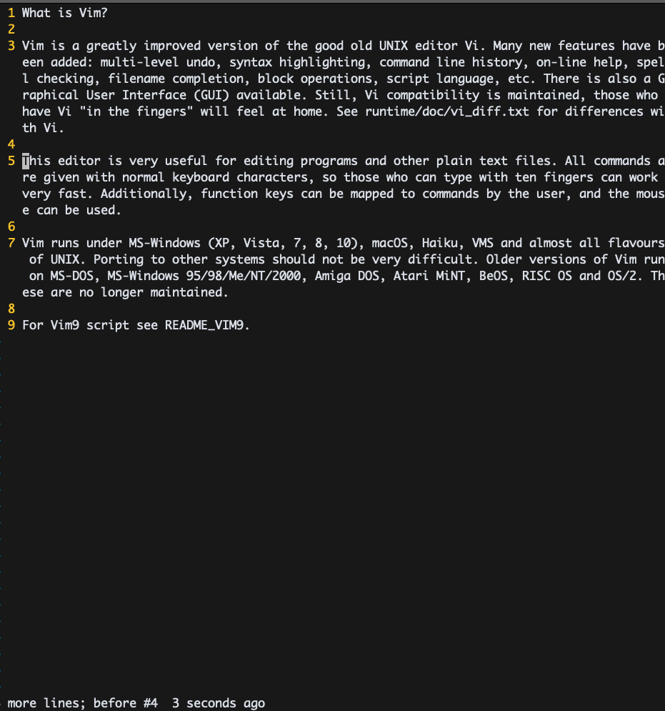
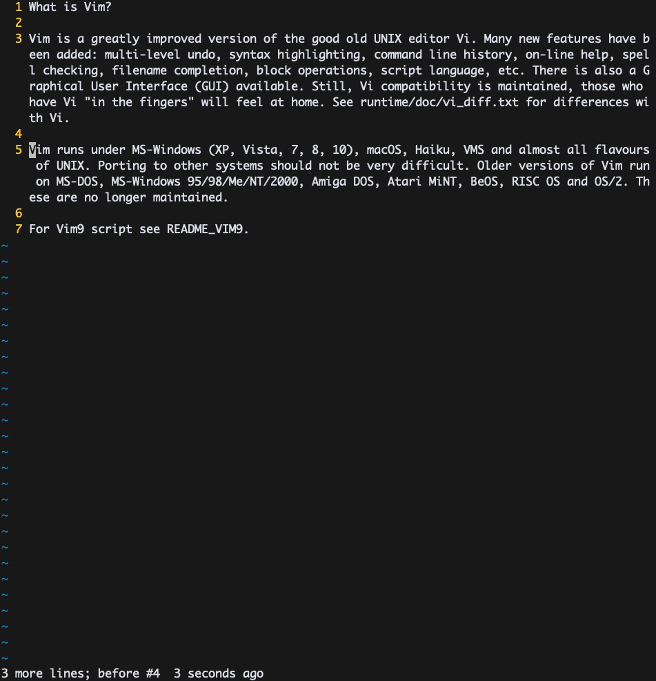

# VIM PRACTICE 13일차

> 책 "손에 잡히는 VIM"의 6장 내용을 공부한 내용입니다. 이 문서는 6.2절만 정리합니다.

## 오퍼레이션 펜딩 모드

일반 모드의 기능 중 명령어가 지연되는 방식을 의미한다. 예를 들어 d를 누를때까지 대기되는데 j을 누르면 현재 행과  아래행이 삭제된다.

d 입력

j 입력 

이와 관련된 명령어는 다음과 같다.

* `d$`: 현재 커서 위치부터 행 끝까지 삭제
* `dd`: 현재 행을 삭제 
* `dj`: 현재 행과 아래 행을 삭제
* `dk`: 현재 행과 위 행을 삭제
* `dw`: 현재 커서 위치부터 단어 끝까지 삭제
* `de`: 커서 위치와 상관없이 단어 하나를 삭제 
* `d^`: 현재 커서 위치부터 행 시작까지 삭제
* `d}`: 현재 커서 위치부터 문단 끝까지 삭제

`y`, `c`의 경우도 똑같이 동작한다. 다만 `y`는 복사 `c`는 변경을 의미한다.

