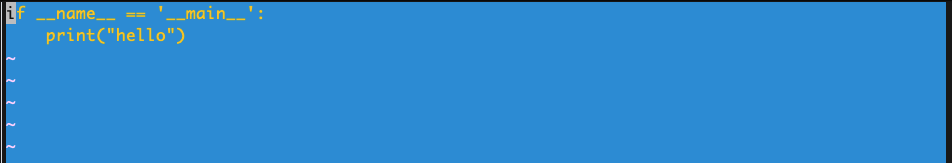

# VIM PRACTICE 14일차

> 책 "손에 잡히는 VIM"의 7장 내용을 공부한 내용입니다. 이 문서는 7.2절만 정리합니다.

## 자동 명령

자동 명령은 특정 파일을 열거나 저장하는 이벤트가 발생할 때 사용자가 지정한 `VIM` 명령을 자동으로 수행시키는 기능이다.

예를 들어서 다음 [예제 파이썬 파일](https://github.com/gurumee92/vim-practice/blob/main/src/day14/ex01.py)을 열어보자. 그럼 다음과 같이 심심한 에디터가 열릴 것이다.


이제 자동명령을 통해서 파이썬 파일을 열 때마다 테마를 변경할 것이다. `~/.vimrc`에 다음을 작성한다.

```
autocmd BufRead,BufNewFile *.py colo blue|set ts=4 sw=4
```

다시 예제 파일을 열었을 때 다음과 같이 변경되는 것을 알 수 있다.



하지만 다른 확장자 파일을 열면 똑같이 아무 테마가 적용되지 않은 심심한 에디터가 보일 것이다. 이런 파일을 열 때 이벤트를 주는 명령어는 다음과 같다.


* BufNewFile: 파일을 새로 생성했을 때
* BufRead: 파일을 읽을 때
* BufWrite: 파일을 저장할 때
* SwapExists: 스왑 파일이 이미 존재할 때

즉 위 설정은 `*.py`의 파일을 읽거나, 새 파일을 만들 때 `colo blue`, `ts=4, sw=4` 설정해주는 자동 명령이다.

또한, `FileType`이라는 것이 있는데, `C++` 같은 경우 확장자가 여러 개이다. 이를 지원하기 위해서 존재한다. 예를 들어 다음 설정을 보자.

```
au FileType cpp colo slate
```

위 설정은 `cpp` 파일의 경우 slate 테마를 설정한다. 또한 이런 자동명령은 그룹화 및 해제가 가능하다. 다음 설정을 본다.

```
augroup UserDefinedColorScheme
    au! # 자동명령 해제
    au FileType sh,perl,python,ruby colo shine # 쉘, 펄, 파이썬, 루비는 shine 테마
    au FileType c,cpp colo slate # c, c++은 slate 테마
    au BufRead,BufNewFile *.txt colo blue # .txt 파일 읽거나 생성 시, blue 테마
augroup END
```


