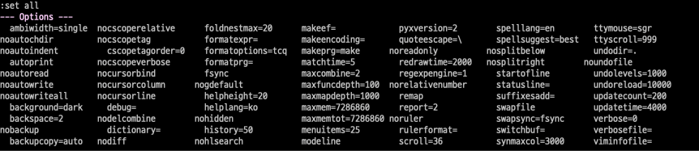

# VIM PRACTICE 3일차

> 책 "손에 잡히는 VIM"의 3장 내용을 공부한 내용입니다. 이 문서는 3.1절만 정리합니다.

## VIM의 옵션

명령행 모드에서 ":set all"을 입력하면, 설정할 수 있는 모든 값을 확인할 수 있다.

이 때, 하단에  "-- More --"라고 뜨는 것을 확인할 수 있는데 더 확인 가능한 메뉴가 있다는 것이다. `enter`나, `space`를 이용해서 남은 설정들을 확인할 수 있다. `q`를 누르면 일반 모드로 돌아온다. 

":set"을 이용하면, 주요 옵션들만 간략하게 확인할 수 있다.

이제 주요 옵션 중 줄 번호 설정만 확인해보자.

## set nu

다음은 [ex01.c](https://github.com/gurumee92/vim-practice/blob/main/src/day3/ex01.c)를 열었을 때 확인할 수 있는 화면이다.

여기서 ":set nu"을 입력해보자. 그럼 다음 화면을 확인할 수 있다.

그 외 주요 설정은 다음과 같다.

* :set ai cindent : C 언어 스타일의 들여쓰기 설정
* :set ts=4 : 탭 크기를 4로 지정
* :set sw=4 : 블록 이동 시 열의 너비를 4로 지정 (보통 ts랑 동일 혹은 2배 정도로 지정)
* :set tw=0 : 편집할 화면의 열 길이를 지정 (0은 설정 비활성화)  
