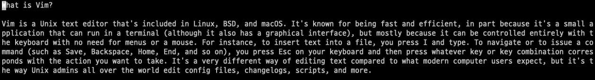
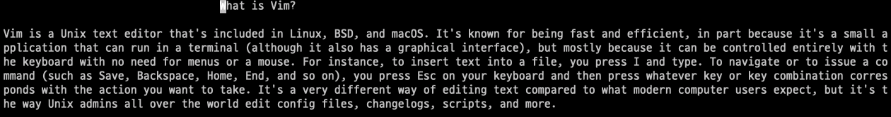
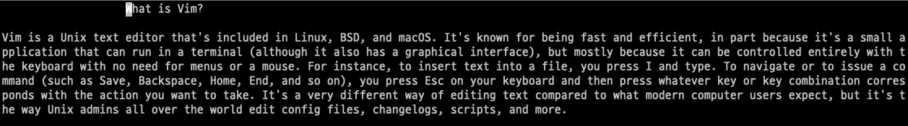

# VIM PRACTICE 4일차

> 책 "손에 잡히는 VIM"의 4장 내용을 공부한 내용입니다. 이 문서는 4.1절만 정리합니다.

## 문자열 정렬

`VIM`은 기본적으로 왼쪽 정렬입니다. 정렬을 바꾸고 싶다면, 다음과 같이 변경할 수 있습니다.

* 가운데 정렬 :center
* 오른쪽 정렬 :right
* 왼쪽 정렬 :left

다음 [예제](https://github.com/gurumee92/vim-practice/blob/main/src/day4/ex01.txt)를 통해서 알아봅시다.

여기서 ":center"를 입력해봅시다. 그럼 다음과 같이 제목의 위치가 변경됩니다.

또한 현재 너비를 무시하고 칸 기준으로 정렬하고 싶다면 ":<정렬><칸수>"를 지정하면 됩니다. 예를 들어 ":center50"이라고 하면 다음과 같이 제목의 위치가 변경됩니다.

