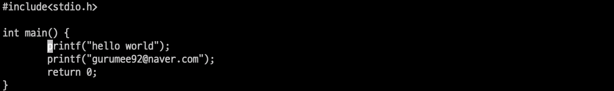
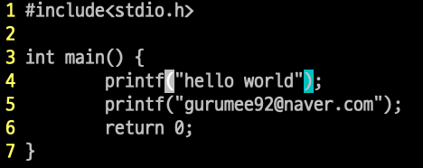
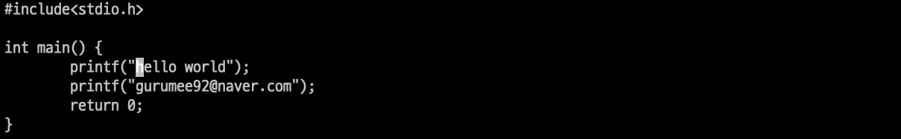
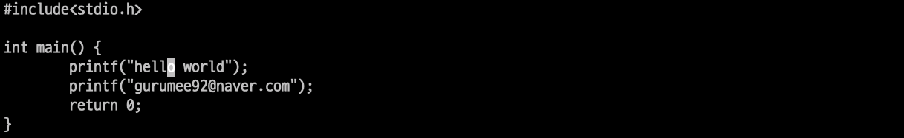
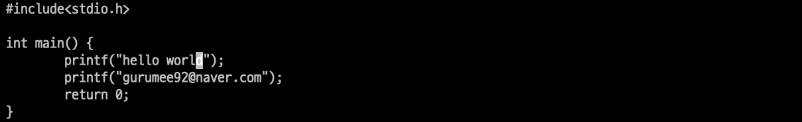
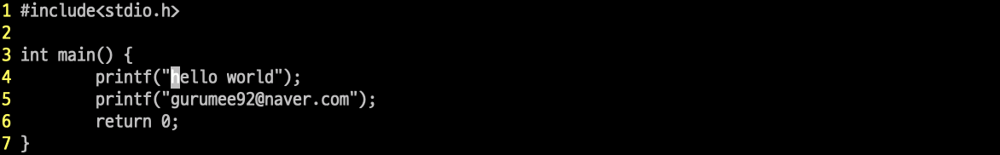

# VIM PRACTICE 6일차

> 책 "손에 잡히는 VIM"의 6장 내용을 공부한 내용입니다. 이 문서는 6.1절만 정리합니다.

## 단어와 문장 사이를 이동하기

`VIM`에서 단어와 문장 사이를 이동할 수 있는 단축키들은 다음과 같습니다. (일반 모드에서 다음 키를 누르면 됩니다.)

* 0: 0번째 열로 이동
* ^: 공백을 제외한 행의 시작 부분
* $: 마지막 열
* w: 단어의 시작 위치 혹은 문장 부호의 경계
* e: w와 동일, 다만 단어의 끝 위치로 이동
* b: w와 유사, 진행방향이 역방향
* W, E, B: w, e, b와 비슷하나 단어가 가진 의미를 따져서 이동

예를 들어 다음 코드([ex01.c](https://github.com/gurumee92/vim-practice/blob/main/src/day6/ex01.c))의 4번째 줄에 p에 커서가 위치되어 있습니다.

여기서 w를 누르면 어떻게 될까요? 바로 다음 단어로 인식되는 (로 이동하게 됩니다.

만약 여기서 w를 한 번 더 누르면 어떻게 될까요? "를 무시하고 다음 단어인 hello의 h로 이동하게 됩니다.

여기서 e를 누르면 어떻게 될까요? 현재 단어의 끝 o로 이동하게 됩니다.

여기서 e를 누르면 어떻게 될까요? 다음 단어 world의 끝 d로 이동하게 됩니다.

여기서 b를 누르면 어떻게 될까요? 현재 단어 world의 시작 w로 이동하게 됩니다.

여기서 b를 누르면 어떻게 될까요? 이전 단어 hello의 시작 h로 이동하게 됩니다.

이런 식으로 위의 단축키를 이용하면 단어와 문장 사이를 오가며 손쉽게 편집할 수 있습니다.

