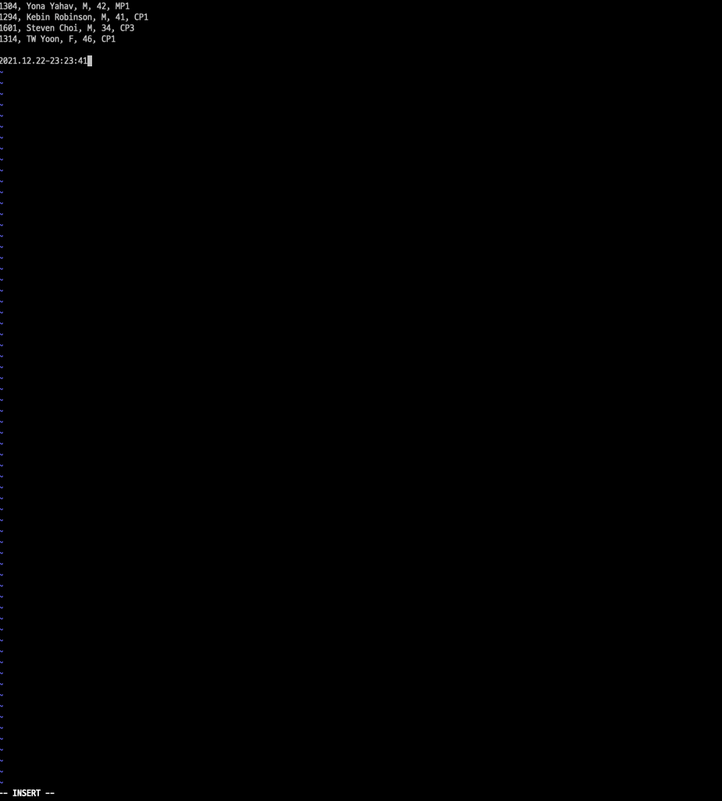

# VIM PRACTICE 7일차

> 책 "손에 잡히는 VIM"의 7장 내용을 공부한 내용입니다. 이 문서는 7.1절만 정리합니다.

## 키 매핑

`VIM`은 여러 단축키를 지정할 수 있습니다. 

* nmap <key> <command> : 일반 모드에서 키를 입력하면 명령어 실행
* imap <key> <command> : 입력 모드에서 키를 입력하면 명령어 실행
* vmap <key> <command> : 비주얼 모드에서 키를 입력하면 명령어 실행
* cmap <key> <command> : 명령 모드에서 키를 입력하면 명령어 실행

입력 모드에서 `CTRL + D`를 누르면 날짜가 보이게끔 설정해봅시다. `~/.vimrc`에 다음과 같이 입력합니다.

```
imap <C-D> <C-R>=strftime("%Y.%m.%d-%H:%M:%S")<CR>
```

그 후 적당한 파일을 열어서  입력 모드로 만들어봅시다. 


아래 그림처럼 커서에 `CTRL + D`를 누르면 다음과 같이 날짜가 만들어지는 것을 확인할 수 있습니다.



