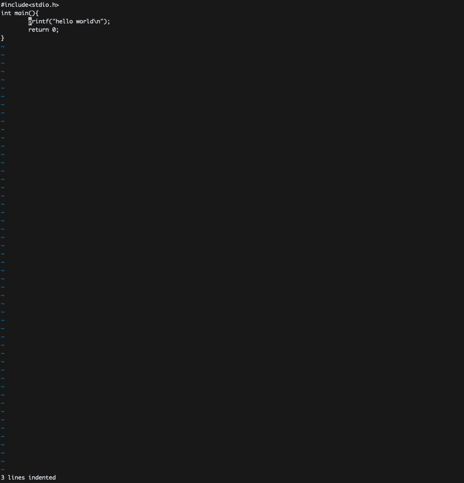

# VIM PRACTICE 8일차

> 책 "손에 잡히는 VIM"의 8장 내용을 공부한 내용입니다. 이 문서는 8.1절만 정리합니다.

## 들여쓰기 재정렬

들여쓰기 재정렬을 할 수 있습니다. 다음과 같은 C 코드가 있다고 해봅시다.

```c
#include<stdio.h>
int main(){
printf("hello world\n");
return 0;
}
```

매우 가독성이 좋지 않습니다. 왜냐 들여쓰기가 1도 안되어있기 때문입니다. 이 때 일반 모드에서 `=G`를 입력하면 C 스타일로 전체 코드가 정렬되는 것을 확인할 수 있습니다. 결과는 다음과 같습니다.


